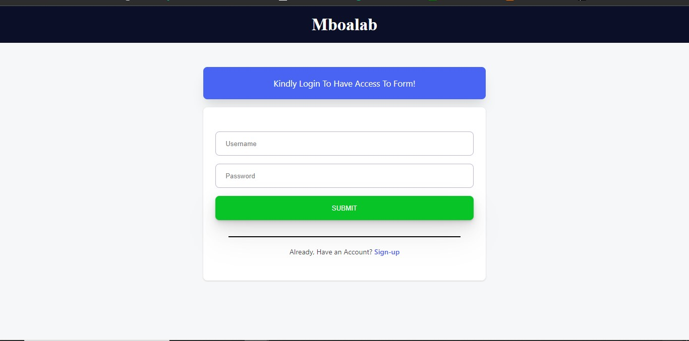
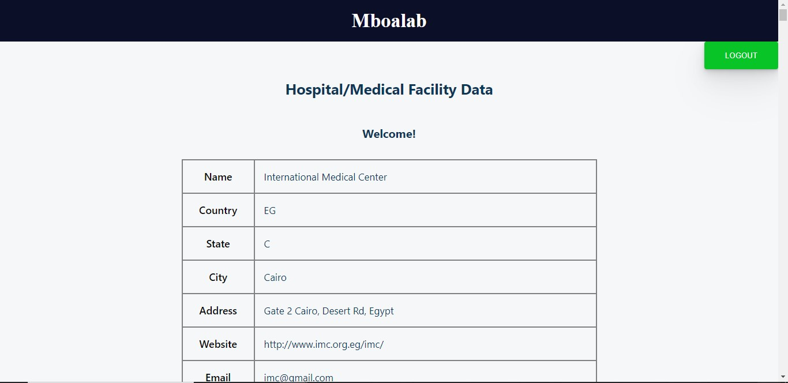

# Data Collection Tool For Task 1
This is a data collection tool for an app that link-up medical facilities globally




## Installation Guide
### Prerequisites
- Node.js (v10.16.0 or later)
- npm package manager (v5.6.0 or later)
- Make sure the backend is set up on your local machine
### Installation Steps
1. Clone the repository to your local machine using the following command:
    ```bash:
    https://github.com/psalmuelle/Mboalab-Task_Frotend.git
    ```
2. Navigate to the project directory:
    ```bash:
    cd Mboalab-Task_Frotend
    ```

3. Install the required dependencies:
    ```
    npm install
    ```
4. Start the application:
    ```
    npm start
    ````

The application should now be running on http://localhost:3000. Open this URL in your web browser to view the app.